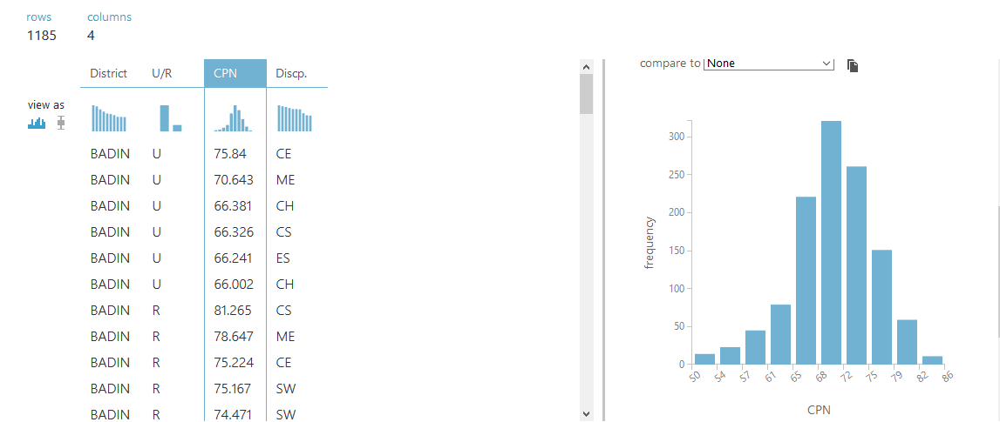

# Technology PREDICTOR

## Description:
Technology predictor is a simple predictor based on Logistic Regression and Decision Tree. It basically predicts the decipline which could be awarded to the student who have recently passed their entry test by entering their DESTRICT, AREA, and CPN.

## Training
The algorithms are trained acording to the marit list of 2016 and on the basics of that I will predict the decipline. The list contains more than 1000 individual records.

## Accuracy 
The accuracy of the algorithms is __0.10__ for _Logistics Regression_ and __0.19__ for _Decision Tree_.

Besides from the accuracy results the algorithms predicts nicely, when we compare form the original list.

## Technology Used
* Python
  * Numpy
  * Pandas
  * Scikit Learn
  * Matplot Lib
  * Seaborn

* Microsoft Azure ML Studio
  * Column Selection Module
  * Decision Tree Module
  * Logistics Regression Module
  * Algorithm Evaluation Module

## Steps to Run 
  * First, Run FeatureExtractor.py
  * Then, Run CleanAndFilterData.py
  * Run, EncodeData.py [ Optional ]
  * Run, Either DecisionTreeModelTraning.py or LinearModelTraning.py 

---

## Dataset
The dataset consits of the following attributes
* Feature Attributes
    * Distirct
    * Area
    * CPN

* Target Attribute
    * Decipline
     
## Documentation
Project Porposal [Click to Download](./DOCS/AICT_Proposal.docx)

Project Report [Click to Download](./DOCS/AICT_Project_Report.docx)

---

## Azure Model

### Visualization

## Testing

